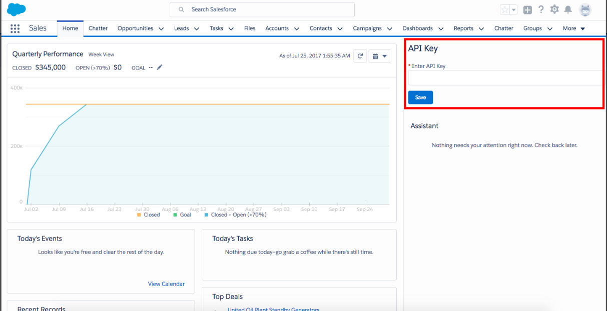

# Route Email2Case by Language
Route Email2Case by Language Demo Component Package

 
 

 Set-up Instructions - 

1. Install the component


2. Use this link to get the API key for a trial version - https://cloud.google.com/translate


3. Drag and drop the component "DE_EnterKeyScreen" on the home page and enter the API key which you just got.


4. Create the case assignment rules so that it routes to the respective queues. In the assignment rules use the condition based on a "Language" field of Case object.


Sample Case Assignment Rule - 


(Case: Case Origin EQUALS Email) AND (Case: Language EQUALS Spanish)


5. Create an Email Service. To create an Email Service in setup, type Email Services click on it and then click on New Email Service. Give any name to the Email Service and attach the class which is named as "DE_Email2CaseLanguageDetection" and then click on Save. 


6. Add an Email Address to the Email Service by clicking on "New Email Address” button.


7. A service email address will be generated, now send an email to this address which will create a new case and detect the subject field of the email and route it to the respective queue using the case assignment rules. 